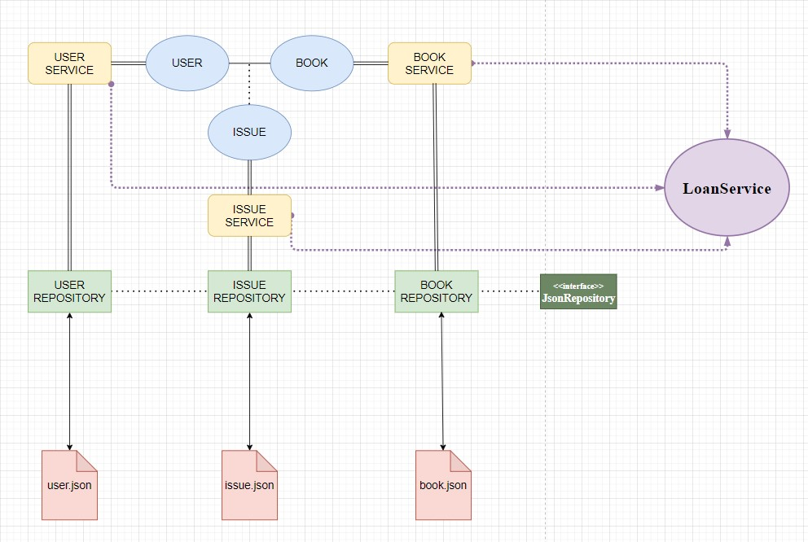

- O design do projeto foi elaborado em camadas para isolar os componentes e manter apenas uma classe responsável por acessar e modificar o respectivo JSON. Para ler e escrever em arquivos, utilizo a biblioteca do Jackson. Os repositórios todos implementam uma interface similar a do JPA, para garantir que todos os repositórios têm as mesmas funções.

- As classes de serviço acessam seus respectivos repositórios. As três entidades básicas do projeto são User, Book & Issue sendo o Issue uma classe que surge da associação do User com o Book. O User tem 4 atributos básicos, sendo os 2 últimos uma alternativa a checar todo o JSON do Issue em busca de quantos livros cada usuário tem no momento e quantos livros um usuário já alugou na vida. No Issue, temos o controle de quem alugou, o que alugou, quando alugou e quando deverá devolver. Caso fosse interessante para o sistema, poderíamos adicionar um novo atributo long que corresponderia ao dia de retorno do livro, assim controlando todo o fluxo de saída e retorno dos livros da biblioteca.

- Por fim, a classe mais importante é o LoanService, que será responsável por orquestrar todo o sistema, chamando os métodos expostos nas demais classes de serviços. Como o processo de alugar um livro envolve múltiplas entidades e serviços, isto é, devemos checar um usuário, checar um livro e criar um registro, é necessário que tenhamos pelo menos uma classe que conheça todos os serviços e possa realizar estas operações múltiplas.

- A classe UI e todo o código na Main servem apenas para imprimir bonitinho e formatado como foi pedido pelo exercício, e fica como prova de que consigo acessar todas as informações que quiser dentro da coleção. Para listar todos os livros emprestados e todos os livros atrasados por usuário, utilizei o Multimap do Google Guava.

- Todos os erros de IDs inválidos, operações inválidas ou retorno com multa jogam exceções personalizadas. O valor da multa por dia e a quantidade máxima de livros estão salvas como static final para flexibilidade futura.

- A operação de alugar mais de um livro é uma operação que acontece por completo ou não acontece, isto é, ou todos os livros são alugados ou nenhum livro é alugado; suponho que assim seja mais interessante porque daria a chance do usuário corrigir a tentativa de aluguel dando preferência para livro A ou B caso só consiga alugar alguns devido ao limite de 5.

- NOTA: O Issue salva todos os registros de saída de livros. Quando um livro é devolvido, o Issue fecha, mas permanece no mesmo JSON. Suponho que seria interessante manter o histórico de saída de livros; caso um livro apareça danificado é só checar qual o usuário que o alugou por último. Entretanto, se o fluxo de livros fosse muito grande, o JSON ficaria enorme muito rápido. Aí imagino que seria melhor ter um JSON separado para as Issues fechadas, já que não imagino que seria muito utilizado. Dito isto, a forma como um novo registro é adicionado funciona apenas se todos os Issues são armazenados no mesmo lugar, já que o ID de cada Issue é o tamanho to JSON + 1, garantindo que todo novo Issue terá um ID único. Caso separássemos os JSON de Issue abertos e fechados, teria que refatorar essa parte.

 

